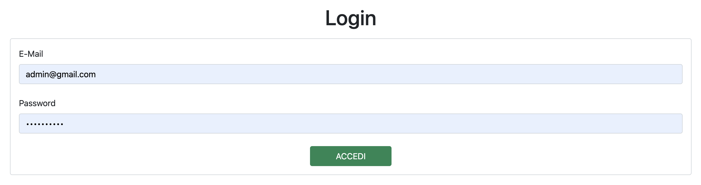
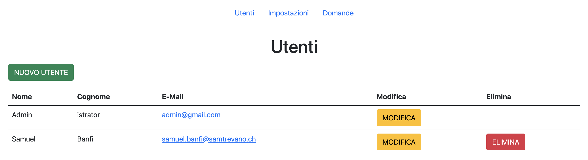
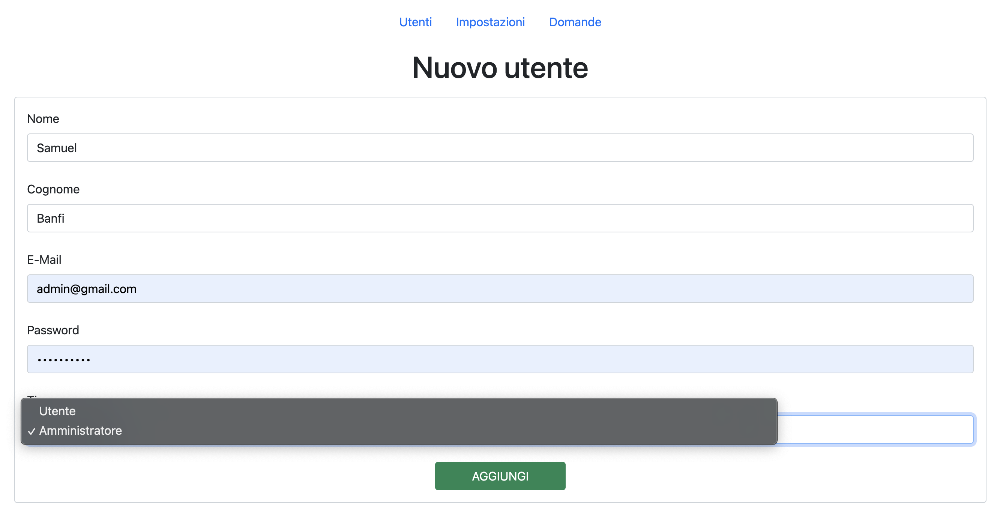
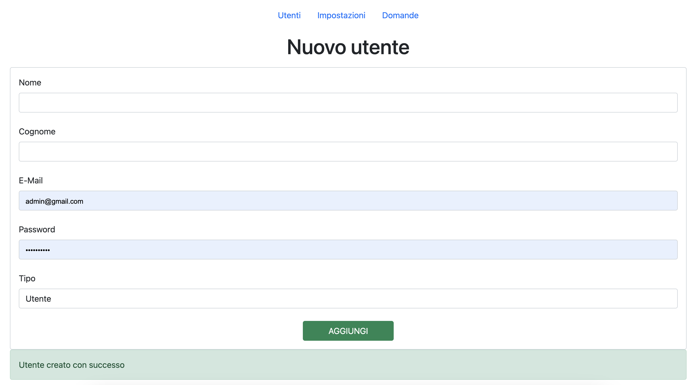

## Indice

1. [Introduzione](#introduzione)

    - [Informazioni sul progetto](#informazioni-sul-progetto)

    - [Scopo](#scopo)

2. [Analisi](#analisi)

    - [Analisi e specifica dei requisiti](#analisi-e-specifica-dei-requisiti)

4. [Implementazione](#implementazione)

5. [Test](#test)

    - [Protocollo di test](#protocollo-di-test)

    - [Risultati test](#risultati-test)

    - [Mancanze/limitazioni conosciute](#mancanze/limitazioni-conosciute)

7. [Conclusioni](#conclusioni)

    - [Sviluppi futuri](#sviluppi-futuri)

    - [Considerazioni personali](#considerazioni-personali)

8. [Sitografia](#sitografia)

<br>

## Introduzione

### Informazioni sul progetto

 - **Titolo**: Questionario patenti 

 - **Allievi coinvolti nel progetto**:
  
   - Samuel Banfi, <a href="mailto:samuel.banfi@samtrevano.ch">samuelbanfi@samtrevano.ch</a>
  
   - Dennis Donofrio, <a href="mailto:dennis.donofrio@samtrevano.ch">dennis.donofrio@samtrevano.ch</a>

 - **Classe**: I4AC, Scuola Arti e Mestieri Trevano, sezione Informatica

 - **Committente**: Massimo Sartori

 - **Data d'inizio**: 05.10.2022

 - **Data di fine**: 21.12.2022

<br>

### Scopo

Lo scopo del progetto "Questionario patenti" è quello di permettere agli utenti prossimi all'esame teorico per la patente di esercitarsi con le domande. Offre la possibilità di rispondere alla domande. In caso di risposta errata c'è la possibilità di apprendere dal proprio errore grazie alla visualizzazione di un video e alla lettura di un documento esplicativo.

<br>

## Analisi

### Analisi e specifica dei requisiti

 | ID | REQ-001 |
 | -------- | - |
 | **Nome** | Login degli utenti |
 | **Priorità** | 1 |
 | **Versione** | 1.1 |
 | **Note** | Deve esserci la maschera di login contenente la mail e la password. |

 <br>

 | ID | REQ-002 |
 | -------- | - |
 | **Nome** | Gestione degli utenti |
 | **Priorità** | 1 |
 | **Versione** | 1.0 |
 | **Note** | L'amministratore può creare, modificare ed eliminare sia utenti che amministratori. Inoltre bisognerà impostare il limite di tempo per il quale è attivo l'account. |

 <br>

 | ID | REQ-003 |
 | -------- | - |
 | **Nome** | Logout degli utenti |
 | **Priorità** | 1 |
 | **Versione** | 1.0 |
 | **Note** | Deve esserci la possibilità di fare logout da tutte le pagine. |

 <br>

 | ID | REQ-004 |
 | -------- | - |
 | **Nome** | Gestione dei settaggi per i formulari |
 | **Priorità** | 1 |
 | **Versione** | 1.0 |
 | **Note** | Dovrà esserci una pagina dedicata ai settaggi dei formulari dove è possibile impostare la durata massima. Inoltre è possibile impostare il numero massimo di errori. Questa pagina è accessibile esclusivamente agli amministratori. |

 <br>

 | ID | REQ-005 |
 | -------- | - |
 | **Nome** | Gestione supporti multimediali |
 | **Priorità** | 1 |
 | **Versione** | 1.0 |
 | **Note** | Dovrà esserci una pagina dedicata alla gestione dei contenuti multimediali come video e documenti per ogni singola domanda. |

 <br>

 | ID | REQ-006 |
 | -------- | - |
 | **Nome** | Avvio di un questionario casuale |
 | **Priorità** | 1 |
 | **Versione** | 1.0 |
 | **Note** | L'utente dovrà poter avviare un questionario contenente 50 domande casuali. Le domande saranno composte da una foto, un testo e 3 risposte possibili. Solo una risposta è corretta. C'è la possibilità di visionare un video e un documento esplicativo. |

 <br>

**Spiegazione elementi tabella dei requisiti:**

**ID**: identificativo univoco del requisito

**Nome**: breve descrizione del requisito

**Priorità**: indica l’importanza di un requisito nell’insieme del
progetto, definita assieme al committente.

**Versione**: indica la versione del requisito. Ogni modifica del
requisito avrà una versione aggiornata.

Sulla documentazione apparirà solamente l’ultima versione, mentre le
vecchie dovranno essere inserite nei diari.

**Note**: eventuali osservazioni importanti o riferimenti ad altri
requisiti.

<br>

## Implementazione

### Il login

L'interfaccia di login è stata fatta in modo molto semplice. L'utente deve inserire l'indirzzo email e la password. Premendo su invia viene controllata l'esistenza dell'account e se esiste viene controllata la password sfruttando la funzione di PHP `password_verify`. Questa funzione controlla se l'hash della password corrisponde alla password in chiaro. In caso di login fallito viene mostrato un errore con la spiegazione. Se l'utente prova ad accedere al controller per il login dopo aveer già effettuato l'accesso viene automaticamenete reindirizzato alla pagina del quiz.

<br>

<p align="center">
  

  <br>

  
</p>

<br>

Per la ricerca dell'utente viene utilizzata la funzione `check_login` della classe `UserManager` che esegue una query sul database che ritorna un array con al suo interno degli array associativi (o/e numerici) che corrispondono ai campi ritornati dalla query. Quindi viene controllato se l'array contiene un elemento e se è presente viene preso il campo password e viene confrontato con il metodo `password_verify(<password_in_chiaro>,<hash>)`. Per evitare le `SQL Injections` vengono usati i `prepared statements` dell'oggetto `PDO`.

<br>

```php
public static function check_login($email, $password) {
    require_once "application/models/Database.php";

    $conn = Database::get_connection();

    $query = "SELECT password FROM utente WHERE email = :email";
    $params = array(':email' => $email);

    $stmt = $conn->prepare($query);
    $stmt->execute($params);

    $result = $stmt->fetchAll();

    if (count($result) == 1) {
        return password_verify($password, $result[0]["password"]);
    } else {
        return false;
    }
}
```

<br>

### La sezione Admin

La sezione admin è destinata ha tutti quei utenti che hanno il roulo amministratore impostato nel database (`admin TINYINT(1)`). Per eseguire il primo login e per registrare i nuovi utenti è stato inserito all'interno del database un utente admin. Nella sezione admin si possono anche gestire le impostazioni dei quiz e si possono gestire le domande.

<br>

```sql
INSERT INTO utente VALUES("admin@gmail.com", "Admin", "istrator", "$2y$10$rt2kMEp4Ij2olyRLj2RA/uQ31zOTRbkNCF3fc7cPhAAQJjyYuIHOK", 1);
```

<br>

#### Gestione utenti

Nella parte di gestione utenti della sezione admin è possibile creare, modificare o eliminare un utente. Nel caso più estremo, quello dell'eliminazione, abbiamo fatto in modo che l'utente attuale non può eliminarsi da solo ma può esclusivamente modificare ed elminare gli altri utenti. In questo modo si evitano i problemi con l'utente collegato alla sessione (utente che non esiste più nel database).

<br>

<p align="center">
  
</p>

<br>

#### Registrazione utenti

L'amministratore può registare un nuovo utente premendo sul pulsante `NUOVO UTENTE` in alto a sinistra. Una volta premuto viene aperta una nuova schermata dove viene chiesto di compilare tutti i campi, ovvero:

<br>

| **Campo** | **Motivo** |
| - | - |
| Nome | Serve solo per identificare l'utente nell'interfaccia grafica |
| Cognome | Serve solo per identificare l'utente nell'interfaccia grafica |
| E-Mail | Viene utilizzato per la gestione degli utenti (login, modifica ed eliminazione) | 
| Password | Viene utilizzata esclusivamente per eseguire l'accesso |
| Tipo di utente | Viene utilizzato per idenitficare chi può accedere all'interfaccia admin ed eseguire operazioni di creazione, modifica o eliminazione |

<br>

<p align="center">
  

  <br>

  
</p>

<br>

Per la creazione dell'utente viene richiamata la funzione `add` della classe `UserManager`. Questa funzione esegue una query di inserimento nel database. Per evitare le `SQL Injections` vengono usati i `prepared statements` dell'oggetto `PDO`. La password viene salvata nel database in formato hash utilizzando la funzione `password_hash` di PHP. Questa funzione genera un hash della password utilizzando l'algoritmo di `BCRYPT`. In questo modo non è possibile recuperare la password in chiaro dal database.

<br>

```php
public static function add($email, $name, $surname, $password, $admin) {
    require_once "application/models/Database.php";

    $password = password_hash($password, PASSWORD_BCRYPT);

    $conn = Database::get_connection();
    $query = "INSERT INTO utente(email, nome, cognome, password, admin) 
        VALUES(:email, :name, :surname, :pwd, :admin)";
    $params = array(
        ':email' => $email,
        ':name' => $name,
        ':surname' => $surname,
        ':pwd' => $password,
        ':admin' => $admin
    );

    try {
        $stmt = $conn->prepare($query);
        $stmt->execute($params);

        return true;
    } catch(PDOException $e) {
        return false;
    }
}
```

<br>

#### Modifica utenti

Nella parte di modifica utenti della sezione admin è possibile modificare i dati di un utente. Per modificare un utente è necessario selezionare l'utente dalla tabella e premere sul pulsante `MODIFICA`. Una volta premuto viene aperta una nuova schermata dove si possono modificare solo alcuni campi. Una volta premuto il pulsante `MODIFICA` viene richiamata la funzione `update` della classe `UserManager`. Questa funzione esegue una query di modifica nel database. Viene effettuato un controllo per verificare se la nuova password corrisponde al controllo della password. Nel caso in cui la nuova password è vuota significa che non va modificata. Oppure se la password inserita corrisponde alla vecchia password, la modifica viene fatta senza tenere in considerazione la password.

<br>

```php
public static function update($email, $name, $surname, $password) {
    ...
    $password = password_hash($password, PASSWORD_BCRYPT);

    $conn = Database::get_connection();
    $query = "SELECT password FROM utente WHERE email = :email";
    $params = array(':email' => $email);

    ...
    if (!password_verify($password, $stored_password) || strcmp($password, "") == 0) {
        $password = password_hash($password, PASSWORD_BCRYPT);
        $query = "UPDATE utente SET nome = :name, cognome = :surname, password = :password WHERE email = :email";
        $params = array(
            ':name' => $name,
            ':surname' => $surname,
            ':password' => $password,
            ':email' => $email
        );
        ...
    } else {
        $query = "UPDATE utente SET nome = :name, cognome = :surname WHERE email = :email";
        $params = array(
            ':name' => $name,
            ':surname' => $surname,
            ':email' => $email
        );
        ...
    }
    ...
}
```

<br>

#### Eliminazione utenti

Per elimnare un utente è necessario selezionare l'utente dalla tabella e premere sul pulsante `ELIMINA`. Una volta premuto viene richiamata la funzione `delete` della classe `UserManager`. Questa funzione esegue una query di eliminazione nel database. Viene effettuato un controllo per verificare se l'utente che si vuole eliminare è l'unico amministratore. In questo caso non è possibile eliminare l'utente. In caso contrario viene eliminato l'utente. Viene effettuato un controllo per verificare se l'utente che si vuole elimare non è l'utente amministratore che sta eseguendo l'operazione. In questo caso non è possibile eliminare l'utente.

<br>

```php
public function delete_user($email) {
    ...
    if (strcmp($email, $_SESSION['user']->get_email()) != 0) {
        if ($this->is_admin()) {
            if (UserManager::delete($email)) {
                ...
            } else {
                ...
            }
            ...
        } else {
            header("location: " . URL);
        }
    }else{
        header("location: " . URL);
    }
}
```

<br>

```php
public static function delete($email) {
    ...
    $conn = Database::get_connection();
    $query = "DELETE FROM utente WHERE email = :email";
    $params = array(':email' => $email);

    try {
        $stmt = $conn->prepare($query);
        $stmt->execute($params);

        return true;
    } catch (PDOException $e) {
        return false;
    }
}
```

<br>

### Gestione domande

Nella sezione admin è possibile gestire le domande. Si possono aggiungere, modificare e rimuovere qualsiasi domanda. La tabella con tutte le domande e i relativi campi viene creata richiamando il metodo `get_all_questions` della classe `QuestionManager`. Questo metodo esegue una `select` sulla tabella `domanda`. Viene restituito un array di oggetti `Question` che rappresentano le domande. Questo array viene poi passato alla vista che si occupa di creare la tabella con tutte le domande. La classe `Question` contiene tutti i campi della tabella `domanda` e i relativi metodi `getter` e `setter`. Inoltre per istanziare una nuova domanda è presente un costruttore che prende in input tutti i campi della tabella `domanda`.

<br>

```php
 public static function get_all_questions() {
    ...
    $query = "SELECT * FROM domanda";
    ...
    foreach ($result as $key => $question) {
        $questions[] = new Question($question["id"], $question["testo"],
            $question["risposta_1"], $question["risposta_2"],
            $question["risposta_3"], $question["risposta_corretta"],
            $question["spiegazione_testo"], $question["spiegazione_video"]
        );
    }

    return $questions;
}
```

<br>

```php
<table class="table">
    <thead>
    <tr>
        <th>Domanda</th>
        ...
    </tr>
    </thead>
    <tbody>
    <?php foreach ($this->questions as $key => $question): ?>
        <tr>
            <td>
                <textarea class="form-control" disabled>
                    <?php echo $question->get_question(); ?>
                </textarea>
            </td>
            ...
        </tr>
    <?php endforeach; ?>
    </tbody>
</table>
```

#### Creazione domande

Per la creazione delle domande l'amministratore deve compilare un form con tutti i campi della tabella `domanda`. Una volta compilato il form viene richiamata la funzione `add` della classe `QuestionManager`. Questa funzione esegue una query di inserimento nel database. Viene effettuato un controllo per verificare se sono stati inseriti tutti i campi. Se non vengono compilati tutti i campi viene mostrato un messaggio di errore. In caso contrario viene inserita la domanda nel database e viene effettuato un filtraggio dei campi per evitare attacchi XSS (`Cross Site Scripting`). Viene effettuato un controllo per verificare se la domanda è stata inserita correttamente. Se la domanda è stata inserita correttamente viene mostrato un messaggio di successo. In caso contrario viene mostrato un messaggio di errore.

<br>

## Test

### Protocollo di test

 | Test Case       | TC-001                               |
 | --------------- |--------------------------------------|
 | **Nome**        |  |
 | **Riferimento** |  |
 | **Descrizione** |  |
 | **Prerequisiti** | - |
 | **Procedura** |  |
 | **Risultati attesi** |  |

### Risultati test

 | Test Case | TC-013 |
 | --------- | ------ |
 | Funzionamento |  |
 | Commento |  |
 | Data |  |

### Mancanze/limitazioni conosciute

## Conclusioni

### Sviluppi futuri

### Considerazioni personali

## Sitografia

 - https://www.php.net/manual/en/function.password-hash.php<br>Data ultima visita: 23.12.2021