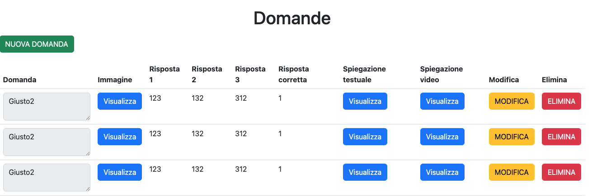
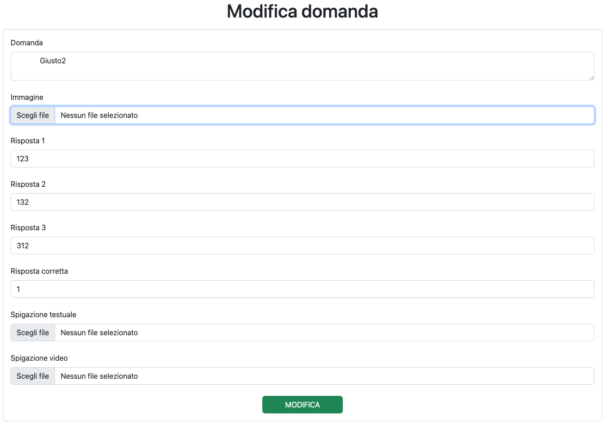
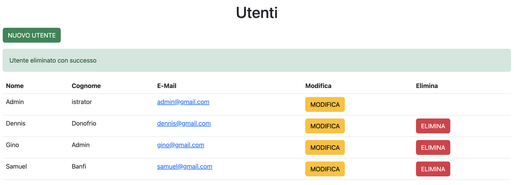
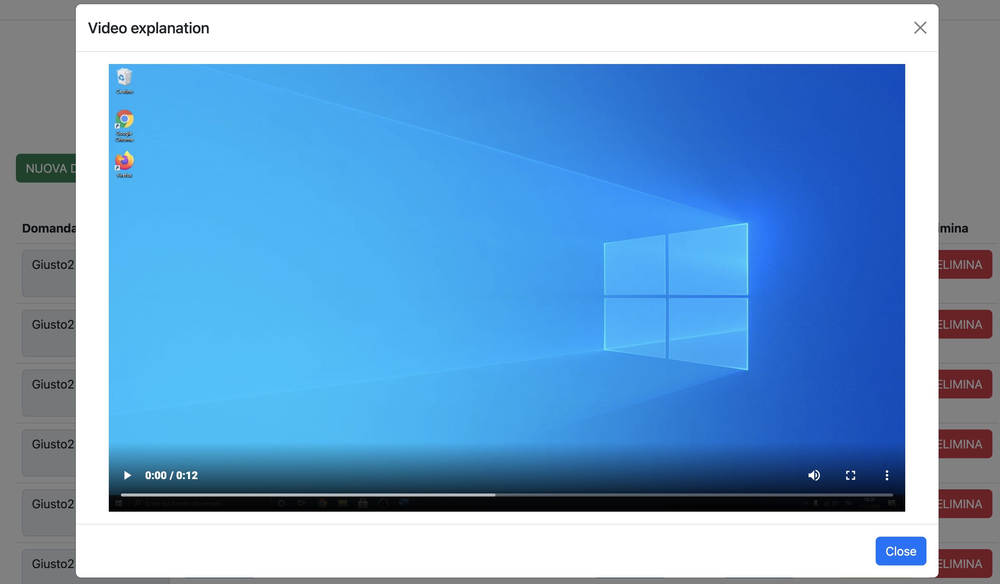
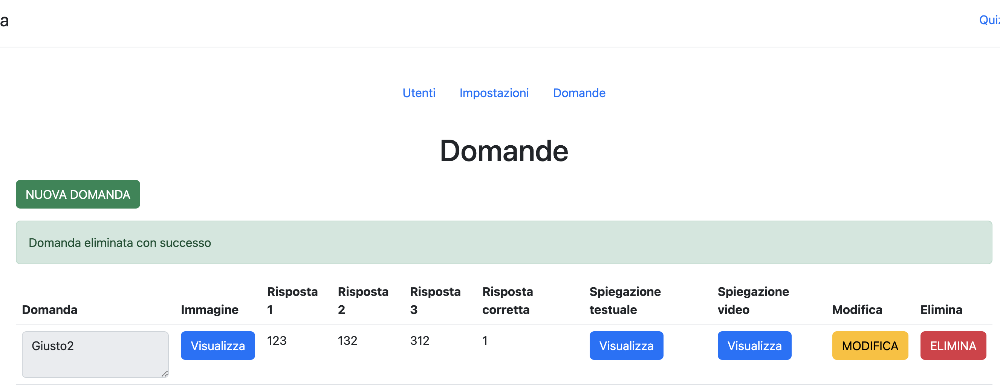
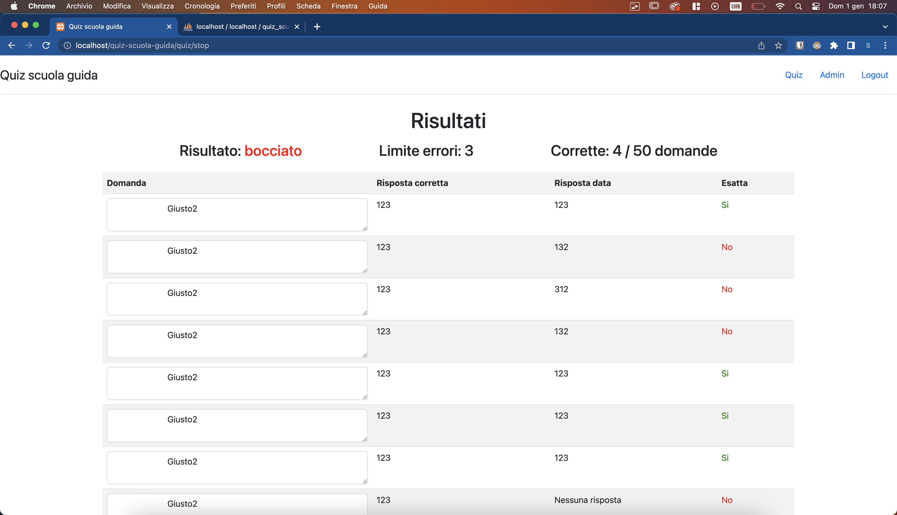

## Indice

- [Indice](#indice)
- [Introduzione](#introduzione)
  - [Informazioni sul progetto](#informazioni-sul-progetto)
  - [Scopo](#scopo)
- [Analisi](#analisi)
  - [Analisi e specifica dei requisiti](#analisi-e-specifica-dei-requisiti)
- [Implementazione](#implementazione)
  - [Il login](#il-login)
  - [La sezione Admin](#la-sezione-admin)
    - [Gestione utenti](#gestione-utenti)
      - [Registrazione utenti](#registrazione-utenti)
      - [Modifica utenti](#modifica-utenti)
      - [Eliminazione utenti](#eliminazione-utenti)
    - [Gestione domande](#gestione-domande)
      - [Creazione domande](#creazione-domande)
      - [Modifica di una domanda](#modifica-di-una-domanda)
    - [Gestione impostazioni](#gestione-impostazioni)
      - [Limiti di tempo](#limiti-di-tempo)
      - [Limite di errori](#limite-di-errori)
      - [Limite scadenza accesso utenti](#limite-scadenza-accesso-utenti)
  - [Quiz](#quiz)
    - [Creazione quiz](#creazione-quiz)
    - [Risposta ad una domanda](#risposta-ad-una-domanda)
    - [Creazione resoconto](#creazione-resoconto)
    - [Gestione tempo limite](#gestione-tempo-limite)
- [Test](#test)
  - [Protocollo di test](#protocollo-di-test)
  - [Risultati test](#risultati-test)
- [Conclusioni](#conclusioni)
  - [Samuel Banfi](#samuel-banfi)
  - [Dennis Donofrio](#dennis-donofrio)
- [Sitografia](#sitografia)

<br>

## Introduzione

### Informazioni sul progetto

 - **Titolo**: Questionario patenti 

 - **Allievi coinvolti nel progetto**:
  
   - Samuel Banfi, <a href="mailto:samuel.banfi@samtrevano.ch">samuelbanfi@samtrevano.ch</a>
  
   - Dennis Donofrio, <a href="mailto:dennis.donofrio@samtrevano.ch">dennis.donofrio@samtrevano.ch</a>

 - **Classe**: I4AC, Scuola Arti e Mestieri Trevano, sezione Informatica

 - **Committente**: Massimo Sartori

 - **Data d'inizio**: 05.10.2022

 - **Data di fine**: 21.12.2022

<br>

### Scopo

Lo scopo del progetto "Questionario patenti" è quello di permettere agli utenti prossimi all'esame teorico per la patente di esercitarsi con le domande. Offre la possibilità di rispondere alla domande. In caso di risposta errata c'è la possibilità di apprendere dal proprio errore grazie alla visualizzazione di un video e alla lettura di un documento esplicativo.

<br>

## Analisi

### Analisi e specifica dei requisiti

 | ID | REQ-001 |
 | -------- | - |
 | **Nome** | Login degli utenti |
 | **Priorità** | 1 |
 | **Versione** | 1.1 |
 | **Note** | Deve esserci la maschera di login contenente la mail e la password. |

 <br>

 | ID | REQ-002 |
 | -------- | - |
 | **Nome** | Gestione degli utenti |
 | **Priorità** | 1 |
 | **Versione** | 1.0 |
 | **Note** | L'amministratore può creare, modificare ed eliminare sia utenti che amministratori. Inoltre bisognerà impostare il limite di tempo per il quale è attivo l'account. |

 <br>

 | ID | REQ-003 |
 | -------- | - |
 | **Nome** | Logout degli utenti |
 | **Priorità** | 1 |
 | **Versione** | 1.0 |
 | **Note** | Deve esserci la possibilità di fare logout da tutte le pagine. |

 <br>

 | ID | REQ-004 |
 | -------- | - |
 | **Nome** | Gestione dei settaggi per i formulari |
 | **Priorità** | 1 |
 | **Versione** | 1.0 |
 | **Note** | Dovrà esserci una pagina dedicata ai settaggi dei formulari dove è possibile impostare la durata massima. Inoltre è possibile impostare il numero massimo di errori. Questa pagina è accessibile esclusivamente agli amministratori. |

 <br>

 | ID | REQ-005 |
 | -------- | - |
 | **Nome** | Gestione supporti multimediali |
 | **Priorità** | 1 |
 | **Versione** | 1.0 |
 | **Note** | Dovrà esserci una pagina dedicata alla gestione dei contenuti multimediali come video e documenti per ogni singola domanda. |

 <br>

 | ID | REQ-006 |
 | -------- | - |
 | **Nome** | Avvio di un questionario casuale |
 | **Priorità** | 1 |
 | **Versione** | 1.0 |
 | **Note** | L'utente dovrà poter avviare un questionario contenente 50 domande casuali. Le domande saranno composte da una foto, un testo e 3 risposte possibili. Solo una risposta è corretta. C'è la possibilità di visionare un video e un documento esplicativo. |

 <br>

 | ID | REQ-007 |
 | -------- | - |
 | **Nome** | Gestione delle domande |
 | **Priorità** | 1 |
 | **Versione** | 1.0 |
 | **Note** | L'amministratore dovrà poter aggiungere, modificare ed eliminare le domande. |

 <br>

**Spiegazione elementi tabella dei requisiti:**

**ID**: identificativo univoco del requisito

**Nome**: breve descrizione del requisito

**Priorità**: indica l’importanza di un requisito nell’insieme del
progetto, definita assieme al committente.

**Versione**: indica la versione del requisito. Ogni modifica del
requisito avrà una versione aggiornata.

Sulla documentazione apparirà solamente l’ultima versione, mentre le
vecchie dovranno essere inserite nei diari.

**Note**: eventuali osservazioni importanti o riferimenti ad altri
requisiti.

<br>

## Implementazione

### Il login

L'interfaccia di login è stata fatta in modo molto semplice. L'utente deve inserire l'indirzzo email e la password. Premendo su invia viene controllata l'esistenza dell'account e se esiste viene controllata la password sfruttando la funzione di PHP `password_verify`. Questa funzione controlla se l'hash della password corrisponde alla password in chiaro. In caso di login fallito viene mostrato un errore con la spiegazione. Se l'utente prova ad accedere al controller per il login dopo aveer già effettuato l'accesso viene automaticamenete reindirizzato alla pagina del quiz.

<br>

<div align="center">
  

  <br>

  
</div>

<br>

Per la ricerca dell'utente viene utilizzata la funzione `check_login` della classe `UserManager` che esegue una query sul database che ritorna un array con al suo interno degli array associativi (o/e numerici) che corrispondono ai campi ritornati dalla query. Quindi viene controllato se l'array contiene un elemento e se è presente viene preso il campo password e viene confrontato con il metodo `password_verify(<password_in_chiaro>,<hash>)`. Per evitare le `SQL Injections` vengono usati i `prepared statements` dell'oggetto `PDO`.

<br>

```php
public static function check_login($email, $password) {
    require_once "application/models/Database.php";

    $conn = Database::get_connection();

    $query = "SELECT password FROM utente WHERE email = :email";
    $params = array(':email' => $email);

    $stmt = $conn->prepare($query);
    $stmt->execute($params);

    $result = $stmt->fetchAll();

    if (count($result) == 1) {
        return password_verify($password, $result[0]["password"]);
    } else {
        return false;
    }
}
```

<br>

### La sezione Admin

La sezione admin è destinata ha tutti quei utenti che hanno il roulo amministratore impostato nel database (`admin TINYINT(1)`). Per eseguire il primo login e per registrare i nuovi utenti è stato inserito all'interno del database un utente admin. Nella sezione admin si possono anche gestire le impostazioni dei quiz e si possono gestire le domande.

<br>

```sql
INSERT INTO utente VALUES("admin@gmail.com", "Admin", "istrator", "$2y$10$rt2kMEp4Ij2olyRLj2RA/uQ31zOTRbkNCF3fc7cPhAAQJjyYuIHOK", 1);
```

<br>

#### Gestione utenti

Nella parte di gestione utenti della sezione admin è possibile creare, modificare o eliminare un utente. Nel caso più estremo, quello dell'eliminazione, abbiamo fatto in modo che l'utente attuale non può eliminarsi da solo ma può esclusivamente modificare ed elminare gli altri utenti. In questo modo si evitano i problemi con l'utente collegato alla sessione (utente che non esiste più nel database).

<br>

<p align="center">
  
</p>

<br>

##### Registrazione utenti

L'amministratore può registare un nuovo utente premendo sul pulsante `NUOVO UTENTE` in alto a sinistra. Una volta premuto viene aperta una nuova schermata dove viene chiesto di compilare tutti i campi, ovvero:

<br>

| **Campo** | **Motivo** |
| - | - |
| Nome | Serve solo per identificare l'utente nell'interfaccia grafica |
| Cognome | Serve solo per identificare l'utente nell'interfaccia grafica |
| E-Mail | Viene utilizzato per la gestione degli utenti (login, modifica ed eliminazione) | 
| Password | Viene utilizzata esclusivamente per eseguire l'accesso |
| Tipo di utente | Viene utilizzato per idenitficare chi può accedere all'interfaccia admin ed eseguire operazioni di creazione, modifica o eliminazione |

<br>

<div align="center">
  

  <br>

  
</div>

<br>

Per la creazione dell'utente viene richiamata la funzione `add` della classe `UserManager`. Questa funzione esegue una query di inserimento nel database. Per evitare le `SQL Injections` vengono usati i `prepared statements` dell'oggetto `PDO`. La password viene salvata nel database in formato hash utilizzando la funzione `password_hash` di PHP. Questa funzione genera un hash della password utilizzando l'algoritmo di `BCRYPT`. In questo modo non è possibile recuperare la password in chiaro dal database.

<br>

```php
public static function add($email, $name, $surname, $password, $admin) {
    require_once "application/models/Database.php";

    $password = password_hash($password, PASSWORD_BCRYPT);

    $conn = Database::get_connection();
    $query = "INSERT INTO utente(email, nome, cognome, password, admin) 
        VALUES(:email, :name, :surname, :pwd, :admin)";
    $params = array(
        ':email' => $email,
        ':name' => $name,
        ':surname' => $surname,
        ':pwd' => $password,
        ':admin' => $admin
    );

    try {
        $stmt = $conn->prepare($query);
        $stmt->execute($params);

        return true;
    } catch(PDOException $e) {
        return false;
    }
}
```

<br>

##### Modifica utenti

Nella parte di modifica utenti della sezione admin è possibile modificare i dati di un utente. Per modificare un utente è necessario selezionare l'utente dalla tabella e premere sul pulsante `MODIFICA`. Una volta premuto viene aperta una nuova schermata dove si possono modificare solo alcuni campi. Una volta premuto il pulsante `MODIFICA` viene richiamata la funzione `update` della classe `UserManager`. Questa funzione esegue una query di modifica nel database. Viene effettuato un controllo per verificare se la nuova password corrisponde al controllo della password. Nel caso in cui la nuova password è vuota significa che non va modificata. Oppure se la password inserita corrisponde alla vecchia password, la modifica viene fatta senza tenere in considerazione la password.

<br>

```php
public static function update($email, $name, $surname, $password) {
    ...
    $password = password_hash($password, PASSWORD_BCRYPT);

    $conn = Database::get_connection();
    $query = "SELECT password FROM utente WHERE email = :email";
    $params = array(':email' => $email);

    ...
    if (!password_verify($password, $stored_password) || strcmp($password, "") == 0) {
        $password = password_hash($password, PASSWORD_BCRYPT);
        $query = "UPDATE utente SET nome = :name, cognome = :surname, password = :password WHERE email = :email";
        $params = array(
            ':name' => $name,
            ':surname' => $surname,
            ':password' => $password,
            ':email' => $email
        );
        ...
    } else {
        $query = "UPDATE utente SET nome = :name, cognome = :surname WHERE email = :email";
        $params = array(
            ':name' => $name,
            ':surname' => $surname,
            ':email' => $email
        );
        ...
    }
    ...
}
```

<br>

##### Eliminazione utenti

Per elimnare un utente è necessario selezionare l'utente dalla tabella e premere sul pulsante `ELIMINA`. Una volta premuto viene richiamata la funzione `delete` della classe `UserManager`. Questa funzione esegue una query di eliminazione nel database. Viene effettuato un controllo per verificare se l'utente che si vuole eliminare è l'unico amministratore. In questo caso non è possibile eliminare l'utente. In caso contrario viene eliminato l'utente. Viene effettuato un controllo per verificare se l'utente che si vuole elimare non è l'utente amministratore che sta eseguendo l'operazione. In questo caso non è possibile eliminare l'utente.

<br>

```php
public function delete_user($email) {
    ...
    if (strcmp($email, $_SESSION['user']->get_email()) != 0) {
        if ($this->is_admin()) {
            if (UserManager::delete($email)) {
                ...
            } else {
                ...
            }
            ...
        } else {
            header("location: " . URL);
        }
    }else{
        header("location: " . URL);
    }
}
```

<br>

```php
public static function delete($email) {
    ...
    $conn = Database::get_connection();
    $query = "DELETE FROM utente WHERE email = :email";
    $params = array(':email' => $email);

    try {
        $stmt = $conn->prepare($query);
        $stmt->execute($params);

        return true;
    } catch (PDOException $e) {
        return false;
    }
}
```

<br>

#### Gestione domande

Nella sezione admin è possibile gestire le domande. Si possono aggiungere, modificare e rimuovere qualsiasi domanda. La tabella con tutte le domande e i relativi campi viene creata richiamando il metodo `get_all_questions` della classe `QuestionManager`. Questo metodo esegue una `select` sulla tabella `domanda`. Viene restituito un array di oggetti `Question` che rappresentano le domande. Questo array viene poi passato alla vista che si occupa di creare la tabella con tutte le domande. La classe `Question` contiene tutti i campi della tabella `domanda` e i relativi metodi `getter` e `setter`. Inoltre per istanziare una nuova domanda è presente un costruttore che prende in input tutti i campi della tabella `domanda`.

<br>

```php
 public static function get_all_questions() {
    ...
    $query = "SELECT * FROM domanda";
    ...
    foreach ($result as $key => $question) {
        $questions[] = new Question($question["id"], $question["testo"],
            $question["risposta_1"], $question["risposta_2"],
            $question["risposta_3"], $question["risposta_corretta"],
            $question["spiegazione_testo"], $question["spiegazione_video"]
        );
    }

    return $questions;
}
```

<br>

Le domande vengono rappresentate con una tabella. Ogni riga della tabella rappresenta una domanda che contiene i campi della tabella `domanda` e dei pulsanti per la modifica e l'eliminazione della domanda. Per la creazione della tabella viene utilizzato il seguente codice:

<br>

```php
<table class="table">
    <thead>
    <tr>
        <th>Domanda</th>
        ...
    </tr>
    </thead>
    <tbody>
    <?php foreach ($this->questions as $key => $question): ?>
        <tr>
            <td>
                <textarea class="form-control" disabled>
                    <?php echo $question->get_question(); ?>
                </textarea>
            </td>
            ...
        </tr>
    <?php endforeach; ?>
    </tbody>
</table>
```

<br>

<div align="center">
    
</div>

<br>

Premendo i tasti `VISUALIZZA` si possono vedere le spiegazioni della domanda (testo e video) oppure l'immagine della domanda. Tramite il click viene visualizzato una modal con il testo o il video della spiegazione. Questa scelta torna molto utile perché non bisogna aprire un'altra pagina ma è tutto nella stessa. La modal è una funzionalità di Bootstrap.

<br>

##### Creazione domande

Per la creazione delle domande l'amministratore deve compilare un form con tutti i campi della tabella `domanda`. Una volta compilato il form viene richiamata la funzione `add` della classe `QuestionManager`. Questa funzione esegue una query di inserimento nel database. Viene effettuato un controllo per verificare se sono stati inseriti tutti i campi. Se non vengono compilati tutti i campi viene mostrato un messaggio di errore. In caso contrario viene inserita la domanda nel database e viene effettuato un filtraggio dei campi per evitare attacchi XSS (`Cross Site Scripting`). Viene effettuato un controllo per verificare se la domanda è stata inserita correttamente. Se la domanda è stata inserita correttamente viene mostrato un messaggio di successo. In caso contrario viene mostrato un messaggio di errore. <br> L'immagine della domanda non viene salvata nel database ma viene salvata nella cartella `quiz_images` del server. Nel database viene salvato il percorso dell'immagine. In questo modo si ha una maggiore sicurezza e si evitano problemi di dimensione del database. Per quanto riguarda la spiegazione video e la spiegazione testuale abbiamo seguito la stessa logica. Per aggiungere un'immagine caricata tramite l'input `file` bisogna specificare nel form il parametro `enctype="multipart/form-data"` per specificare che il form contiene dati binari. Dal lato del server bisogna specificare il parametro `$_FILES` per accedere ai dati dell'immagine caricata. Per salvare l'immagine abbiamo creato un metodo `generate_name` che si occupa di creare un nome univoco in modo tale da evitare conflitti come ad esempio due immagini con lo stesso nome.

<br>

```php
private function generate_name()
{
    $characters = "abcdefghijklmnopqrstuvwxyzABCDEFGHIJKLMNOPQRSTUVWXYZ0123456789";
    $name = "";

    for ($i = 0; $i < 20; $i++) {
        $name .= $characters[rand(0, strlen($characters) - 1)];
    }

    return $name;
}
```

<br>

Per l'aggiunta effettiva sul server bisogna utilizzare il metodo `move_uploaded_file` che si occupa di spostare il file temporaneo caricato sul server nella cartella specificata. Il metodo `move_uploaded_file` prende in input il percorso del file temporaneo e il percorso finale. Il percorso finale è costituito dal percorso della cartella dove salvare l'immagine e il nome univoco generato dal metodo `generate_name`. Per eseguire un ulteriore controllo sull'esistenta del file abbiamo usato il metodo `file_exists` che prende in input il percorso del file e restituisce `true` se il file esiste, `false` altrimenti.

<br>

##### Modifica di una domanda

Per modficare la domande l'utente amministratore può compilare tutti i campi della domanda e cliccare sul pulsante `Modifica`. Questo richiama la funzione `update` della classe `QuestionManager`. Questa funzione esegue una query di aggiornamento nel database. Viene effettuato un controllo per verificare se sono stati inseriti tutti i campi. Se non vengono compilati tutti i campi viene mostrato un messaggio di errore. In caso contrario viene aggiornata la domanda nel database.

<br>

<div align="center">
    
</div>

<br>

#### Gestione impostazioni

##### Limiti di tempo

I limiti di tempo sono impostati tramite un form. L'amministratore può modificare i limiti di tempo per ogni quiz. Ci sono 3 valori predefiniti: 30 minuti, 50 minuti, illimitato. L'amministratore può scegliere esclusivamente uno di questi 3 valori. Per questo abbiamo utilizzato i `radio button` che permettono di selezionare un solo elemento di un gruppo. Per far si che i 3 input fossero nello stesso gruppo abbiamo impostato a tutti e 3 gli elementi il seguente attributo: `name="time"`. Infine per mostrare all'utente qual'è dei tre valori è attualmente utilizzato abbiamo impostato l'attributo `checked` all'elemento che corrisponde al valore ritornato dal database tramite la funzione `get_limit_time` della classe `SettingsManager`. Se dovesse esserci un errore nella query viene ritornato `-1`.

<br>

```php
public static function get_limit_time() {
    require_once "application/models/Database.php";

    $conn = Database::get_connection();
    $query = "SELECT limite_tempo FROM impostazioni";
    
    try {
        $stmt = $conn->prepare($query);
        $stmt->execute();

        $result = $stmt->fetchAll();

        return $result[0]["limite_tempo"];
    } catch (PDOException $e) {
        return -1;
    }
}
```

##### Limite di errori

Il limite di errori consentiti in una esercitazione è possibile modificarlo dalle impostazioni. Questa operazione può essere effettuata esclusivamente dagli amministratori. La scelta non è completamente personalizzabile in quanto si può scegliere tra soli 3 valori: 3, 5, 7. Per scegliere il limite di errori bisogna selezionare un `radio button`.

##### Limite scadenza accesso utenti

La scadenza degli utenti determina per quanto tempo un utente può fare l'accesso al sito. Quando l'utente arriva alla data di scadenza viene eliminato. La data di scadenza viene modificata nelle impostazioni esclusivamente dagli amministratori. Per modificare la data di scadenza bisogna modificare il valore nella pagina `Impostazioni` tramite un input `text`.<br>
La seguente procedura serve per controllare tutti gli utenti presenti nel database e cancellare tutti quelli che hanno superato la data di scadenza. Come prima cosa viene prelevato la data di scadenza da un'altra tabella. Dopo viene creato un cursore per percorrere tutta la tabella `utente`. In fine viene passato un utente alla volta per controllare se l'utente è scaduto. In caso che l'utente è scaduto viene eliminato, altrimenti si passa al successivo.

<br>

```sql
DELIMITER //
CREATE PROCEDURE elimina_utente()
BEGIN
    DECLARE limite_accesso_utente DATETIME DEFAULT (SELECT limite_accesso_utente FROM impostazioni);
    DECLARE utenti CURSOR FOR SELECT email,data_creazione,admin FROM utente;
    DECLARE CONTINUE HANDLER FOR NOT FOUND SET finito = TRUE;

    OPEN utenti;
    loop_utenti: LOOP
        FETCH utenti INTO email,data_eliminazione,admin;

        IF finito THEN
            LEAVE loop_utenti;
        END IF;

        IF admin = 1 THEN
            CONTINUE loop_utenti;
        END IF;

        IF data_creazione + INTERVAL limite_accesso_utente MONTH < NOW() THEN
            DELETE FROM utente WHERE email = email;
        END IF;
    END LOOP;
    CLOSE utenti;
END
DELIMITER ;
```

La procedura deve partire ogni giorno per controllare gli utenti. Per fare questo si necessita un evento. Per fare questo bisogna creare un `EVENT`. L'evento creato qui sotto richiama la procedura `elimina_utente`. Questo evento farà partire la procedura `elimina_utente` con i permessi dell'utente `'quiz_scuola_guida'@'%'`. Questo serve per dare solo i permessi necessari e diminuisce le possibilità di creare problemi per un bug.

```sql
DELIMITER //
CREATE
DEFINER = 'quiz_scuola_guida'@'%'
EVENT evento_elimina_utente
ON SCHEDULE EVERY 1 DAY
DO
    CALL elimina_utente();
// DELIMITER ;
```

### Quiz

#### Creazione quiz

Per generare un quiz l'utente deve premere il pulsante `INIZIA ORA` nella sezione `Quiz`. Questo richiama la funzione `start` del controller `Quiz`. Questa funzione richiama la funzione `get_all_questions` della classe `QuestionManager` che esegue una query di selezione nel database e ritorna tutte le domande presenti nel database. Per ottenere le domande casuali viene utilizzata la funzione `shuffle` di PHP che mischia gli elementi di un array. Successivamente viene eseguito un ciclo di 50 ripetizioni per ottenere le prime 50 domande nell'array con le domande già mischiate.

<br>

```php
if (QuestionManager::get_count_questions()[0][0] < 50) {
    $_SESSION['error_question_count'] = true;
    header("location: " . URL);
}

$all_questions = QuestionManager::get_all_questions();
$questions = array();

shuffle($all_questions);

for ($i = 0; $i < 50; $i++) {
    $questions[] = $all_questions[$i];
}

$_SESSION["questions"] = $questions;
```

<br>

Dopo aver ottenuto le domande viene generato un altro array di 50 elementi che contiene la risposta inserita. Ci sono tre possibili valori: 
 - `-1` indica che l'utente non ha risposto alla domanda.
 - `1` indica che l'utente ha selezionato la prima risposta.
 - `2` indica che l'utente ha selezionato la seconda risposta.
 - `3` indica che l'utente ha selezionato la terza risposta.
Non possono essere inseriti altri valori all'interno dell'array. Questi valori vengono successivamente controllati per verificare se l'utente ha risposto correttamente o meno (capitolo [creazione resoconto](#creazione-resoconto)). Infine viene richiamata la funzione `game` del controller `Quiz` che mostra la prima domanda. Alla funzione viene passato il parametro `id` che serve per identificare la domanda da mostrare. Il suo valore deve essere compreso tra 1 e 50. In caso che il valore non sia compreso tra 1 e 50 viene impostato a 1 se minore di 1 e a 50 se maggiore di 50. Se il valore è `null` viene impostato a 1.

<br>

```php
$id = $id == null ? 1 : $id;
$id = $id < 1 ? 1 : $id;
$id = $id > 50 ? 50 : $id;

$this->view->id = $id;
$this->view->question = $_SESSION["questions"][$id - 1];
```

<br>

#### Risposta ad una domanda

Per non dover ricaricare la pagina ogni volta che l'utente cambia la risposta alla domanda abbiamo creato una funzione tramite `Ajax` che prende come parametri l'id della domanda, la risposta selezionata (1,2,3) e l'url di base del sito. Questa funzione viene richiamata ogni volta che l'utente cambia la risposta alla domanda. Questa funzione richiama la funzione statica `set_answer` che associa la risposta (`answer_id`) data dall'utente alla domanda (`question_id`). La risposta viene aggiunta all'array alla posizione `question_id`. Questa ciclo di aggiornamento viene fatto ogni volta che l'utente cambia la risposta alla domanda tramite l'evento `onchange`. Per sicurezza vengono controllati i parametri:
 - Per `question_id` viene controllato che sia un numero intero e che sia compreso tra 0 e 49.
 - Per `answer_id` viene controllato che sia un numero intero e che sia compreso tra 1 e 3.
 
<br>

```php
if ($question_id >= 0 && $question_id <= 49) {
    if ($answer_id >= 1 && $answer_id <= 3) {
        $_SESSION["answ"][$question_id] = (int) $answer_id;
    }
}
```

#### Creazione resoconto

Nella pagina del resoconto ci sono vari elementi molto interessanti. Il primo ed il più atteso da tutti gli allievi è l'esito. Per controllare l'esito viene usata la funzione `has_passed_exam`. 

```php
<h3>
    Risultato:
    <?php if ($this->has_passed_exam): ?>
        <span style="color:green">promosso</span>
    <?php else: ?>
        <span style="color:red">bocciato</span>
    <?php endif; ?>
</h3>
```

Nella funzione `has_passed_exam` viene controllato se l'utente ha superato l'esame oppure no. L'utente ha superato l'esame solamente se la quantità di errori è uguale o minore di quella consentita.

```php
private function has_passed_exam() {
    require_once 'application/models/User.php';
    require_once 'application/models/Question.php';
    require_once 'application/models/QuestionManager.php';

    if (!isset($_SESSION)) {
        session_start();
    }

    $limit_errors = QuestionManager::get_limit_errors();

    if ($limit_errors == -1) {
        return false;
    } else {
        $count_errors = 50 - $this->get_count_correct_answers();
        return $count_errors <= $limit_errors;
    }
}
```

Nelle seguenti linee di codice vengono semplicemente stampati sulla pagina dei valori.

```php
<div>
    <h3>Limite errori: <?php echo $this->limit_errors; ?></h3>
</div>
<div>
    <h3>Corrette: <?php echo $this->count_correct_answers; ?> / 50 domande</h3>
</div>
```

Con le seguenti linee di codice viene inserita la domanda nella tabella.

```php
<div class="form-control">
    <?php echo $this->questions[$i]->get_question(); ?>
</div>
```

Il codice seguente serve per stampare la risposta corretta nella tabella. Si necessita di fare uno switch perchè nel database viene salvato solo il numero della risposta corretta. In questo modo si può vedere la risposta corretta e capire dove si ha sbagliato.

```php
<p>
    <?php 
        switch ($this->questions[$i]->get_correct_answer()) {
            case 1:
                echo $this->questions[$i]->get_answer_1();
                break;
            case 2:
                echo $this->questions[$i]->get_answer_2();
                break;
            case 3:
                echo $this->questions[$i]->get_answer_3();
                break;
        }
    ?>
</p>
```

Il codice seguente serve per stampare la risposta che l'utente ha selezionato durante il quiz. Viene usato uno switch perchè in `answare` è salvato l'id. Se non è stata selezionata nessuna risposta, `answare` conterrà il valore `-1` e nel report verrà stampato `Nessuna risposta`.

```php
<p>
    <?php 
        switch ($this->answers[$i]) {
            case 1:
                echo $this->questions[$i]->get_answer_1();
                break;
            case 2:
                echo $this->questions[$i]->get_answer_2();
                break;
            case 3:
                echo $this->questions[$i]->get_answer_3();
                break;
            case -1:
                echo "Nessuna risposta";
                break;
        }
    ?>
</p>
```

Con il codice seguente si finisce la riga della tabella scrivendo se la risposta data è corretta oppure no.

```php
<?php if ($this->questions[$i]->get_correct_answer() == $this->answers[$i]): ?>
    <p style="color: green">Si</p>
<?php else: ?>
    <p style="color: red">No</p>
<?php endif; ?>
```

<br>

#### Gestione tempo limite

Per gestire il limite di tempo per il quale l'utente può rispondere alle domande abbiamo utilizzato la funzione `setTimeout` di JavaScript. Inizialmente viene richiamata una funzione che ogni secondo controlla se l'utente si trova ancora nella pagina del quiz. Se l'utente non si trova più nella pagina del quiz la funzione `setTimeout` viene interrotta. Uno dei metodi per controllare se l'utente si trova ancora nella pagina del quiz è controllare se esiste un elemento con id `remainingTime`. Se esiste viene richiamata la funzione `startTime` che chiama `countdown` che decrementa il timer ogni secondo. La funzione `checkCountdownLoaded` viene richiamata ogni secondo per controllare se l'utente si trova ancora nella pagina del quiz. Se l'utente non si trova più nella pagina del quiz la funzione finisce.

<br>

```javascript
function checkCountdownLoaded() {
    if (document.getElementById("remainingTime") != null) {
        countdownBaseUrl = document.getElementById("remainingTime").getAttribute("data-url");
        startTime();
    } else {
        setTimeout(checkCountdownLoaded, 1000);
    }
}
```

<br>

Se l'utente si trova ancora nella pagina del quiz viene avviata una funzione che decrementa il timer ogni secondo. Quando il timer arriva a 0 viene richiamata la funzione `stopQuiz` che termina il quiz e mostra il resoconto. La funzione `stopQuiz` viene richiamata anche quando l'utente clicca sul pulsante `Termina quiz`. La funzione `stopQuiz` semplicemente imposta l'indirizzo della pagina a cui si vuole andare impostando la proprietà `location.href`.

<br>

```javascript
function countdown() {
    if (location.href.indexOf("quiz/game") == -1 && location.href.indexOf("quiz/start") == -1) {
        return;
    }

	timeLeft--;
	document.getElementById("remainingTime").innerHTML = formatTime(timeLeft) + " minuti";

	if (timeLeft > 0) {
		setTimeout(countdown, 1000);
	} else {
        stopQuiz(countdownBaseUrl + "quiz/stop");
	}
};
```

<br>

Per ottenere il tempo limite da decrementare viene richiamata tramite `Ajax` la funzione di PHP `get_time_limit` che restituisce il tempo rimanente dall'inizio del quiz in secondi (`tempo limite` - (`tempo attuale` - `tempo inizio`)). Questa funzione viene richiamata ogni secondo per aggiornare il tempo rimanente tramite Javascript. Abbiamo deciso di optare per il tempo rimanente quando viene generato il timer per evitare il problema del reset del countdown quando viene ricaricata la pagina.

<br>

```javascript
function getLimitTime(url) {
    xmlhttp = new XMLHttpRequest();
    xmlhttp.onreadystatechange = function() {
        if (this.readyState == 4 && this.status == 200) {
            timeLeft = parseInt(this.responseText);
        }
    };
    xmlhttp.open("GET", url, false);
    xmlhttp.send();
}
```

<br>

## Test

### Protocollo di test

 | Test Case | TC-001 |
 | -------- | - |
 | **Nome** | Accesso con utente amministratore |
 | **Riferimento** | REQ-001 |
 | **Descrizione** | Bisogna controllare che l'utente amministratore (preesistente) possa accedere al sito. |
 | **Prerequisiti** | - |
 | **Procedura** | 1. Inserire l'indirizzo email dell'amministratore <br> 2. Inserire la password dell'amministratore |
 | **Risultati attesi** | L'utente viene redirezionato alla pagina principale dove viene chiesto di iniziare un quiz. Nell'header del sito viene mostrata la voce `admin`. |
 
 | Test Case | TC-002 |
 | -------- | - |
 | **Nome** | Creazione utente |
 | **Riferimento** | REQ-002 |
 | **Descrizione** | Bisogna controllare che l'utente amministratore (preesistente) possa accedere alla sezione admin del sito e che possa creare un nuovo utente. |
 | **Prerequisiti** | REQ-001 |
 | **Procedura** | 1. Accedere come amministratore <br> 2. Accedere alla sezione `admin` <br> 3. Premere il pulsante `NUOVO UTENTE` <br> 4. Compilare tutti i campi impostando il `tipo` su `utente`. |
 | **Risultati attesi** | Viene mostrato un'allerta che indica che l'utente è stato creato con successo. |

 | Test Case | TC-003 |
 | -------- | - |
 | **Nome** | Modifica utente |
 | **Riferimento** | REQ-002 |
 | **Descrizione** | Bisogna controllare che l'utente amministratore (preesistente) possa modificare un utente. |
 | **Prerequisiti** | - |
 | **Procedura** | 1. Accedere come amministratore <br> 2. Accedere alla sezione `admin` <br> 3. Premere il pulsante `MODIFICA` <br> 4. Modificare almeno un campo. |
 | **Risultati attesi** |  |

 | Test Case | TC-004 |
 | -------- | - |
 | **Nome** | Eliminazione utente |
 | **Riferimento** | REQ-002 |
 | **Descrizione** | Bisogna controllare che l'utente amministratore (preesistente) possa accedere alla sezione admin del sito e che possa eliminare un utente. |
 | **Prerequisiti** | REQ-001 |
 | **Procedura** | 1. Accedere come amministratore <br> 2. Accedere alla sezione `admin` <br> 3. Premere il pulsante `ELIMINA` su un utente |
 | **Risultati attesi** | Viene mostrato un'allerta che indica che l'utente è stato eliminato con successo. |

 | Test Case | TC-005 |
 | -------- | - |
 | **Nome** | Logout utenti |
 | **Riferimento** | REQ-003 |
 | **Descrizione** | Bisogna controllare che l'utente possa eseguire il logout dal suo profilo. |
 | **Prerequisiti** | REQ-001 |
 | **Procedura** | 1. Accedere al sito <br> 2. Premere il pulsante logout in alto a destra |
 | **Risultati attesi** | L'utente viene reindirizzato alla pagina di login. |

 | Test Case | TC-006 |
 | -------- | - |
 | **Nome** | Modifica delle impostazioni del quiz |
 | **Riferimento** | REQ-004 |
 | **Descrizione** | Bisogna controllare che l'utente amministratore (preesistente) possa modificare le impostazioni dei quiz. |
 | **Prerequisiti** | REQ-001 |
 | **Procedura** | 1. Accedere come amministratore <br> 2. Accedere alla sezione `admin` <br> 3. Accedere alla sezione `Impostazioni` <br> 4. Modificare un'impostazione <br> 5. Premere il pulsante `IMPOSTA` |
 | **Risultati attesi** | Viene mostrato un'allerta che indica che le impostazioni sono state salvate con successo. |

 | Test Case | TC-007 |
 | -------- | - |
 | **Nome** | Gestione supporti multimediali |
 | **Riferimento** | REQ-005 |
 | **Descrizione** | Bisogna controllare che l'utente amministratore possa vedere l'immagine della domanda, il video e la spiegazione testuale all'interno della stessa pagina. |
 | **Prerequisiti** | REQ-001 |
 | **Procedura** | 1. Accedere come amministratore <br> 2. Accedere alla sezione `admin` <br> 3. Premere su `DOMANDE` <br> 4. Premere il pulsante `VISUALIZZA` su `spiegazione video` di una domanda |
 | **Risultati attesi** | Viene mostrato un pop-up con il video da far partire. |

 | Test Case | TC-008 |
 | -------- | - |
 | **Nome** | Inizio di un questionario |
 | **Riferimento** | REQ-006 |
 | **Descrizione** | Bisogna controllare che l'utente possa avviare un questionario con 50 domande casuali. |
 | **Prerequisiti** | REQ-001 |
 | **Procedura** | 1. Accedere al sito <br> 2. Premere il pulsante `INIZIA ORA` nella sezione `Quiz`. <br> 3. Concludere il quiz. <br> 4. Avviare un altro quiz. |
 | **Risultati attesi** | Le domande mostrate da un quiz ad un altro saranno diverse. |

 | Test Case | TC-009 |
 | -------- | - |
 | **Nome** | Aggiunta di una domanda |
 | **Riferimento** | REQ-007 |
 | **Descrizione** | Bisogna controllare che l'amministratore possa aggiungere una domanda. |
 | **Prerequisiti** | REQ-001 |
 | **Procedura** | 1. Accedere come amministratore <br> 2. Accedere alla sezione `admin` <br> 3. Accedere alla sezione `domande` <br> 4. Premere il pulsante `NUOVA DOMANDA` <br> 5. Compilare tutti i campi. |
 | **Risultati attesi** | Viene mostrato un'allerta che indica che la domanda è stata salvata con successo. |

 | Test Case | TC-010 |
 | -------- | - |
 | **Nome** | Modifica domanda |
 | **Riferimento** | REQ-007 |
 | **Descrizione** | Bisogna controllare che l'amministratore possa modificare una domanda. |
 | **Prerequisiti** | REQ-001 |
 | **Procedura** | 1. Accedere come amministratore <br> 2. Accedere alla sezione `admin` <br> 3. Accedere alla sezione `domande` <br> 4. Premere il pulsante `MODIFICA` di una domanda <br> 5. Modificare almeno un campo e reinserire i files. |
 | **Risultati attesi** | Viene mostrato un'allerta che indica che la domanda è stata modificata con successo. |

 | Test Case | TC-011 |
 | -------- | - |
 | **Nome** | Rimozione domanda |
 | **Riferimento** | REQ-006 |
 | **Descrizione** | Bisogna controllare che l'amministratore possa eliminare una domanda. |
 | **Prerequisiti** | REQ-001 |
 | **Procedura** | 1. Accedere come amministratore <br> 2. Accedere alla sezione `admin` <br> 3. Accedere alla sezione `domande` <br> 4. Premere il pulsante `ELIMINA` di una domanda |
 | **Risultati attesi** | Viene mostrato un'allerta che indica che la domanda è stata eliminata con successo. |

 | Test Case | TC-012 |
 | -------- | - |
 | **Nome** | Controllo tempistiche |
 | **Riferimento** | REQ-006 |
 | **Descrizione** | Bisogna controllare che l'utente venga inviato alla pagina del report quando scade il tempo limite. |
 | **Prerequisiti** | REQ-001 |
 | **Procedura** | 1. Accedere al sito <br> 2. Premere il pulsante `INIZIA ORA` nella sezione `Quiz` <br> 3. Aspettare la fine del fine del quiz |
 | **Risultati attesi** | l'utente viene reindirizzato alla pagina con il report finale. |

### Risultati test

 | Test Case | TC-001 |
 | --------- | ------ |
 | Funzionamento | PASSATO |
 | Commento | <div align="center"></div> |
 | Data | 02.01.2023 |

<br>

 | Test Case | TC-002 |
 | --------- | ------ |
 | Funzionamento | PASSATO |
 | Commento | <div align="center"></div> |
 | Data | 02.01.2023 |

 <br>

 | Test Case | TC-003 |
 | --------- | ------ |
 | Funzionamento | PASSATO |
 | Commento | <div align="center"></div> |
 | Data | 02.01.2023 |

 <br>

 | Test Case | TC-004 |
 | --------- | ------ |
 | Funzionamento | PASSATO |
 | Commento | <div align="center"></div> |
 | Data | 02.01.2023 |

 <br>

 | Test Case | TC-005 |
 | --------- | ------ |
 | Funzionamento | PASSATO |
 | Commento | <div align="center"></div> |
 | Data | 02.01.2023 |

 <br>

 | Test Case | TC-006 |
 | --------- | ------ |
 | Funzionamento | PASSATO |
 | Commento | <div align="center"></div> |
 | Data | 02.01.2023 |

 <br>

 | Test Case | TC-007 |
 | --------- | ------ |
 | Funzionamento | PASSATO |
 | Commento | <div align="center"></div> |
 | Data | 02.01.2023 |

 <br>

 | Test Case | TC-008 |
 | --------- | ------ |
 | Funzionamento | PASSATO |
 | Commento | <div align="center"></div> |
 | Data | 02.01.2023 |

 <br>

 | Test Case | TC-009 |
 | --------- | ------ |
 | Funzionamento | PASSATO |
 | Commento | <div align="center"></div> |
 | Data | 02.01.2023 |

 <br>

 | Test Case | TC-010 |
 | --------- | ------ |
 | Funzionamento | PASSATO |
 | Commento | <div align="center"></div> |
 | Data | 02.01.2023 |

 <br>

 | Test Case | TC-011 |
 | --------- | ------ |
 | Funzionamento | PASSATO |
 | Commento | <div align="center"></div> |
 | Data | 02.01.2023 |

 <br>

 | Test Case | TC-012 |
 | --------- | ------ |
 | Funzionamento | PASSATO |
 | Commento | <div align="center"></div> |
 | Data | 02.01.2023 |

 <br>

<br>

## Conclusioni

### Samuel Banfi

Questo progetto mi è servito principalmente per migliorare le mie competenze nel lavoro di squadra. Mi sono trovato molto bene a lavorare con Dennis per riusciamo a capire subito le necessità dell'altro . Se avevo un problema era subito pronto ad aiutarmi e viceversa. Al lavoro avevo già fatto un progetto simile, ma non era così complicato. Per esempio non dovevo gestire l'eliminazione di un utente dopo un determinato tempo. Inoltre ho imparato a gestire meglio la gestione delle pagine grazie alle modal di Bootstrap e ad Ajax per non dover ricaricare la pagina ogni volta che si eseguiva un'operazione sul server. Grazie ad Ajax siamo riusciti ad impostare la risposta dell'utente per una specifica domanda senza dover ricaricare la pagina ogni volta che modificava la sua scelta. Grazie all'eliminazione temporizzata degli utenti ho imparato invece a sfruttare al meglio le possibilità di MySQL con le procedure e gli eventi. Infine sono riuscito a migliorare le mie competenze di gestione di un progetto proprio perché l'abbiamo fatto in squadra, di conseguenza dovevamo gestirci bene per non avere problemi a livello di codice durante il commit e il merge su GitHub (problemi di merge conflict).

<br>

### Dennis Donofrio

Questo progetto mi è stato utile per imparare ad usare meglio Ajax. Ajax è uno strumento molto potente e grazie ad Ajax ho capito come fare una API. Mi è piaciuto lavorare con Samuel perchè siamo riusciti a lavorare bene. Ci sono stati alcuni problemi quando bisognava lavorare in contemporanea. Il problema principale era quando si faceva il merge dei progetti. Inoltre abbiamo notato che a scuola non è possibile avviare xampp su una macchina e collegarsi da un'altra. Questo sarebbe molto comodo sia per fare delle presentazioni che per svolgere attività di gruppo. Non ho mai portato avanti un progetto cosi complicato. Sono contento e soddisfatto che siamo riusciti a finirlo.

<br>

## Sitografia

 - https://www.php.net/manual/en/function.password-hash.php <br >Data ultima visita: 11.12.2021
 - https://www.php.net/manual/en/function.move-uploaded-file.php <br> Data ultima visita: 15.12.2021
 - https://www.php.net/manual/en/function.file-exists <br> Data ultima visita: 15.12.2021
 - https://dev.mysql.com/doc/refman/8.0/en/events-overview.html#:~:text=MySQL%20Events%20are%20tasks%20that,a%20specific%20date%20and%20time. <br> Data ultima visita: 24.12.2021